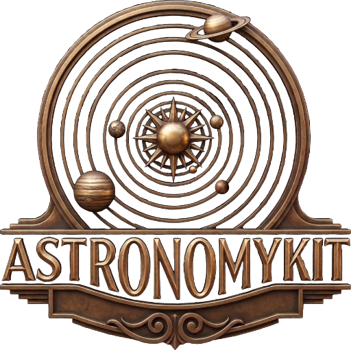

<p align="center">
  
</p>

<p align="center">
AstronomyKit is a Swift library for calculating positions of the Sun, Moon, planets, and fixed stars.<br>
Predicts moon phases, eclipses, transits, and rise/set times.<br>
Accurate to ±1 arcminute, based on VSOP87 and NOVAS C 3.1 models validated against JPL Horizons. Runs entirely on-device.
</p>

<p align="center">
Built on Don Cross’ <a href="https://github.com/cosinekitty/astronomy">Astronomy Engine</a> C library.
</p>

<p align="center">

[](https://swift.org)
[](https://swift.org)
[](LICENSE)
[](https://heirloomlogic.github.io/AstronomyKit/documentation/astronomykit/)

</p>

## Features

- Positions for the Sun, Moon, planets, and Jupiter's moons
- Moon phase angles, quarters, illumination, and libration
- User-defined fixed stars from J2000 catalog coordinates
- Gravity-simulated position for 2060 Chiron
- Rise, set, and culmination times
- Lunar and solar eclipse predictions
- Equinoxes and solstices
- Coordinate transforms across equatorial, ecliptic, horizon, and galactic systems
- Planetary conjunctions, oppositions, and relative longitude search
- Apsides, elongation, and transits
- Generic root-finding search for custom astronomical events
- Full `Sendable` conformance for Swift 6

## Installation

### Swift Package Manager

Add to your `Package.swift`:

```swift
dependencies: [
    .package(url: "https://github.com/heirloomlogic/AstronomyKit.git", from: "0.2.0")
]
```

Or in Xcode: **File → Add Package Dependencies** and enter the repository URL.

## Quick Start

```swift
import AstronomyKit

// Your location
let observer = Observer(latitude: 40.7128, longitude: -74.0060)  // NYC

// Current moon phase
let angle = try Moon.phaseAngle(at: .now)
print("\(Moon.emoji(for: angle)) \(Moon.phaseName(for: angle))")

// Next sunrise
if let sunrise = try CelestialBody.sun.riseTime(after: .now, from: observer) {
    print("Sunrise: \(sunrise.date)")
}

// Where is Mars?
let mars = try CelestialBody.mars.horizon(at: .now, from: observer)
print("Mars: \(mars.altitude)° \(mars.compassDirection)")
```

## Usage

### Time

```swift
// Current time
let now = AstroTime.now

// From components
let time = AstroTime(year: 2025, month: 6, day: 21, hour: 12)

// From Foundation Date
let time = AstroTime(Date())

// Time arithmetic
let tomorrow = now.addingDays(1)
let nextHour = now.addingHours(1)
```

### Observer Location

```swift
let seattle = Observer(latitude: 47.6062, longitude: -122.3321)
let denver = Observer(latitude: 39.7392, longitude: -104.9903, height: 1609)

// Built-in
let greenwich = Observer.greenwich
```

### Celestial Bodies

```swift
// Available bodies
let planets = CelestialBody.planets  // Mercury through Neptune
let galileanMoons = CelestialBody.galileanMoons  // Io, Europa, Ganymede, Callisto

// Body properties
print(CelestialBody.mars.name)           // "Mars"
print(CelestialBody.mars.orbitalPeriod)  // ~686 days
```

### Position Calculations

```swift
// Horizon coordinates (altitude/azimuth)
let horizon = try CelestialBody.jupiter.horizon(at: .now, from: observer)
print("Altitude: \(horizon.altitude)°")
print("Azimuth: \(horizon.azimuth)° (\(horizon.compassDirection))")

// Equatorial coordinates (RA/Dec)
let eq = try CelestialBody.saturn.equatorial(at: .now)
print("RA: \(eq.rightAscensionFormatted)")   // "02h 15m 30.2s"
print("Dec: \(eq.declinationFormatted)")     // "+12° 34' 56.7""

// Distance from Sun
let au = try CelestialBody.mars.distanceFromSun(at: .now)
```

### Moon Phases

```swift
// Current phase
let angle = try Moon.phaseAngle(at: .now)
print(Moon.phaseName(for: angle))     // "Waxing Gibbous"
print(Moon.emoji(for: angle))         // "🌔"
print(Moon.illumination(for: angle))  // 0.0 to 1.0

// Find specific phases
let nextFull = try Moon.searchPhase(.full, after: .now)
let nextNew = try Moon.searchPhase(.new, after: .now)

// All quarters in January 2025
let quarters = try Moon.quarters(
    from: AstroTime(year: 2025, month: 1, day: 1),
    to: AstroTime(year: 2025, month: 2, day: 1)
)
```

### Fixed Stars

```swift
// Define a star from J2000 catalog coordinates
let algol = FixedStar(
    name: "Algol",
    ra: 3.136148,      // Right ascension in hours
    dec: 40.9556,      // Declination in degrees
    distance: 92.95    // Distance in light-years
)

// Ecliptic longitude
let longitude = try algol.eclipticLongitude(at: .now)
print("Algol is at \(longitude)°")

// Horizon coordinates
let horizon = try algol.horizon(at: .now, from: observer)
print("Algol: \(horizon.altitude)° altitude")
```

### Chiron

```swift
// Chiron's ecliptic longitude (commonly used in astrology)
let longitude = try Chiron.eclipticLongitude(at: .now)
print("Chiron is at \(longitude)°")

// Full ecliptic coordinates
let ecliptic = try Chiron.ecliptic(at: .now)
print("Longitude: \(ecliptic.longitude)°, Latitude: \(ecliptic.latitude)°")

// Horizon position for an observer
let horizon = try Chiron.horizon(at: .now, from: observer)
print("Chiron altitude: \(horizon.altitude)°")
```

### Rise/Set Times

```swift
let sunrise = try CelestialBody.sun.riseTime(after: .now, from: observer)
let sunset = try CelestialBody.sun.setTime(after: .now, from: observer)
let moonrise = try CelestialBody.moon.riseTime(after: .now, from: observer)

// Upper culmination (transit)
let transit = try CelestialBody.sun.culmination(after: .now, from: observer)
print("Max altitude: \(transit.horizon.altitude)°")
```

### Seasons

```swift
let seasons = try Seasons.forYear(2025)
print("Spring: \(seasons.marchEquinox)")
print("Summer: \(seasons.juneSolstice)")
print("Autumn: \(seasons.septemberEquinox)")
print("Winter: \(seasons.decemberSolstice)")
```

### Eclipses

```swift
// Next lunar eclipse
let lunar = try Eclipse.searchLunar(after: .now)
print("\(lunar.kind) lunar eclipse at \(lunar.peak)")

// Next solar eclipse
let solar = try Eclipse.searchGlobalSolar(after: .now)
if solar.kind == .total, let lat = solar.latitude, let lon = solar.longitude {
    print("Total solar eclipse visible at \(lat)°, \(lon)°")
}

// All eclipses in 2025
let eclipses = try Eclipse.lunarEclipses(
    from: AstroTime(year: 2025, month: 1, day: 1),
    to: AstroTime(year: 2026, month: 1, day: 1)
)
```

### Conjunctions and Oppositions

```swift
// When is Mars next at opposition? (closest to Earth, brightest)
let opposition = try CelestialBody.mars.searchOpposition(after: .now)
print("Mars opposition: \(opposition.date)")

// When is Jupiter next in superior conjunction? (behind the Sun)
let conjunction = try CelestialBody.jupiter.searchSuperiorConjunction(after: .now)
print("Jupiter conjunction: \(conjunction.date)")

// Relative ecliptic longitude between two bodies
let angle = try CelestialBody.venus.pairLongitude(with: .mars, at: .now)
print("Venus-Mars separation: \(angle)°")
```

## API Reference

| Type | Description |
|------|-------------|
| `Apsis` | Perihelion/aphelion or perigee/apogee events |
| `AstroTime` | Time representation with UT/TT and `Date` conversion |
| `CelestialBody` | Enum of Sun, Moon, planets, and moons |
| `Chiron` | Gravity-simulated position for 2060 Chiron |
| `Constellation` | Constellation identification |
| `Ecliptic` | Ecliptic longitude and latitude coordinates |
| `Elongation` | Angular separation from the Sun |
| `Equatorial` | Right ascension and declination coordinates |
| `FixedStar` | User-defined star from J2000 coordinates |
| `GlobalSolarEclipse` | Solar eclipse with peak location |
| `GravitySimulation` | N-body gravity simulation |
| `Horizon` | Altitude and azimuth for local sky position |
| `Illumination` | Visual magnitude and phase fraction |
| `LagrangePoint` | L1-L5 point calculations |
| `Libration` | Lunar libration angles and distance |
| `LocalSolarEclipse` | Solar eclipse visibility from observer |
| `LunarEclipse` | Lunar eclipse event with timing and duration |
| `LunarNode` | Ascending/descending node events |
| `MoonPhase` | Lunar phase enum (new, first quarter, full, third quarter) |
| `Observer` | Geographic location (latitude, longitude, height) |
| `RotationMatrix` | Coordinate system transformations |
| `AstroSearch` | Generic root-finding search for custom events |
| `Seasons` | Equinox and solstice times for a year |
| `StateVector` | Position and velocity state vector |
| `Sun` | Sun position and ecliptic longitude search |
| `Transit` | Mercury/Venus solar transit |

## Beyond Astronomy Engine

AstronomyKit includes features not present in the upstream C library:

| Feature | Description |
|---------|-------------|
| `Chiron` | Gravity-simulated positions for 2060 Chiron using pre-computed JPL Horizons state vectors at reference epochs (2000–2040). Astronomy Engine has no built-in Chiron support. |
| `FixedStar` | Thread-safe value type for user-defined stars from J2000 catalog coordinates. Wraps Astronomy Engine's `Astronomy_DefineStar()` with mutex-protected calculation slots and a Swift-idiomatic API. |

All other AstronomyKit types wrap Astronomy Engine C functions directly.

## Documentation

DocC documentation is available. Build it locally:

```bash
swift package generate-documentation --target AstronomyKit
```

Or in Xcode: **Product → Build Documentation**

## Requirements

**Runtime:** Swift 6.0+, macOS 15+ / iOS 18+ / tvOS 18+ / watchOS 11+ / Linux / Windows.

**Development:** Xcode 26.3 (Swift 6.3). The swift-format build tool plugin is pinned to a toolchain; see [Toolchain Alignment](#toolchain-alignment).

## Built With AstronomyKit

- **[Fallow](https://heirloomlogic.com/fallow)** — Lunar fasting companion. Calculates Ekadashi and moon cycle timing.
- **[Edict](https://heirloomlogic.com/edict)** — Electional astrology planner. Scans planetary positions to find timing windows for decisions.

## Contributing

Contributions are welcome. See [CONTRIBUTING.md](CONTRIBUTING.md) for guidelines.

## Credits

- [Astronomy Engine](https://github.com/cosinekitty/astronomy) by Don Cross — the underlying C library (see [THIRD_PARTY_NOTICES](THIRD_PARTY_NOTICES))

## License

MIT License. See [LICENSE](LICENSE) for details.
